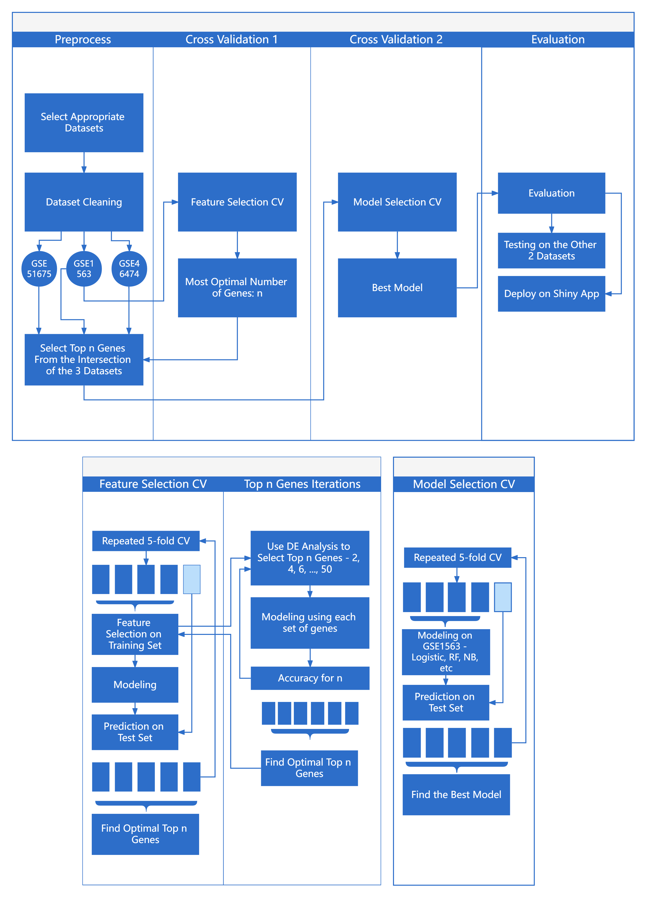

## Executive Summary

Kidney transplantation is one of the most successful treatments to improve the quality of life of individuals with end-stage renal illnesses [@garcia_global_2012]. Yet it is limited due to risks and rejection. To use gene expression values to predict the outcome of kidney graft, in this project, we aimed to design an accurate yet parsimonious predictor of kidney transplantation outcomes for doctors that includes gene expression values as variables.

We selected GSE51675, GSE1563 and GSE46474 from the 58 Gene Expression Omnibus (GEO) datasets provided. After cleaning, transforming and scaling, we used GSE1563 as our training set and the other two as our testing set. These datasets included age, gender and gene expression values.

We then identified the most optimal number of genes to include in our final model by differential expression (DE) analysis in repeated cross-validation (CV). We compared the accuracy of models containing 2 - 50 top genes selected by DE analysis in each CV iteration. We found the most optimal number of this CV iteration when the accuracy is the highest. Eventually, a list of the most optimal numbers and selected genes were generated. The most frequently used optimal number is 2, and a few most commonly included genes are BTN3A1, STAT1, CD163 and TBC1D2B.

Afterwards, we trained five classifiers using age, gender and 2 top genes selected by DE analysis from the intersection of the three datasets, including 6-Nearest Neighbor, Naïve Bayes, Random Forest, Support Vector Machine and Weighted Logistic Regression. After testing accuracy, sensitivity and specificity performances using in-sample repeated CV and on independent datasets, and also evaluating model stability, classifier fairness and computation cost, we selected the Naïve Bayes classifier as our final model and deployed it on a Shiny app. Our final Naïve Bayes model had an accuracy, a sensitivity and a specificity of $(88\%, 61\%, 97\%)$ in training set repeated CV, and $(61\%, 22\%, 100\%)$, $(65\%, 35\%, 95\%)$ on independent datasets. It was both stable and fair, and its computational cost was small.

As a result of our investigations, we have found an accurate, stable and fair yet parsimonious Naïve Bayes model for predicting kidney graft outcomes by age, gender and two gene expression values (SLC22A14, TAP2), which is good at identifying stable outcomes. By allowing doctors to predict their patients' kidney graft outcomes conveniently, our model could potentially expand the usage of kidney transplantation to save more lives and reduce the prevalence of kidney-transplantation-related diseases. Our final model was deployed as a [Shiny app](https://zephyralistair.shinyapps.io/DATA3888_KidneyA1/).

We also identified a few most variable target genes related to kidney graft outcomes. Future analysis can be performed to investigate their clinical implications.

Limitations were found, and future work was suggested as follows: to improve the diversity, transnationality and validity of our data and classifier, to pay more attention to the methods of data collection, including sequencing platform and sample types, to re-design the feature selection algorithm to reduce its time complexity.

In conclusion, our model and findings can serve as a foundation for a more diverse, sensitive yet parsimonious classifier that accurately yet efficiently predicts kidney graft outcomes for the benefit of renal illness patients. Further research in both medicine and statistics can be performed to improve the classifier's performance and identify the selected genes' clinical implications.


```{r setup, include = FALSE}
## loading and setup

knitr::opts_chunk$set(echo = TRUE)
Sys.setlocale(locale = "C")
library(GEOquery)
library(tidyverse)
library(limma)
library(VennDiagram)
library(cvTools)
library(e1071)
library(randomForest)
library(class)
library(naivebayes)
library(knitr)
library(fairness)
library(patchwork)
library(grid)
library(tiff)
library(rmdformats)

load("datasets.rdata")

## datasets are cached in "datasets.rdata"

# gse1 <- getGEO("GSE51675")
# gse1 <- gse1$GSE51675_series_matrix.txt.gz
# 
# gse2 <- getGEO("GSE1563")
# gse2 <- gse2$GSE1563_series_matrix.txt.gz
# 
# gse3 <- getGEO("GSE46474")
# gse3 <- gse3$GSE46474_series_matrix.txt.gz
seed = 3888

## writing bibs for used packages
knitr::write_bib(c(.packages()), "packages.bib")
```

## 1. Introduction

Kidney transplantation is one of the most successful treatments to improve the quality of life of individuals with end-stage renal illness [@garcia_global_2012]. Although kidney transplantation can treat severe kidney disease, it is limited and not frequently utilized due to risks and rejection. With the use and development of genetic sequencing analysis techniques, different gene expression values can be used to predict the outcome of kidney transplantation. The expression value of a gene in RNAseq data analysis represents how much it is expressed in a cell.

To that end, in this project, we aimed to design an accurate yet parsimonious predictor of kidney transplantation outcomes for doctors that could be used in various datasets. In particular, the model we trained should be easy to use and interpret for a doctor and should contain gene expression values as variables. We planned to [deploy](https://zephyralistair.shinyapps.io/DATA3888_KidneyA1/) our model by an R package Shiny for demonstration.

An overview of our workflow is provided below [Fig.1].

```{r intro, fig.cap="Fig.1 Work Flow Chart"}
## include a flow chart generated at ProcessOn

```

## 2. Initial Data Analysis

We started by taking a look at all the datasets provided. There were 58 Gene Expression Omnibus (GEO) datasets. The protein data provided is uninterpretable, so we mainly focused on the gene expression datasets. We continued to investigate their quality and variables and eventually chose the three of them, [GSE51675](https://www.ncbi.nlm.nih.gov/geo/query/acc.cgi?acc=GSE51675), [GSE1563](https://www.ncbi.nlm.nih.gov/geo/query/acc.cgi?acc=GSE1563) and [GSE46474](https://www.ncbi.nlm.nih.gov/geo/query/acc.cgi?acc=GSE46474). These three datasets were relatively clean and contained clinical information such as gender and age.

There were 18 samples and 41093 features in GSE51675, 62 samples and 12625 features in GSE1563, and 40 samples and 54613 features in GSE46474.

We then drew boxplots [Appendix Fig.5] of their gene expression values to check whether any data of them needed to be Log2 transformed.

```{r cleaning, results='hide'}
## check the dim of the datasets, results omitted
dim(gse1)
dim(gse2)
dim(gse3)

## clean row names, replace them by refseq
gse1_have_ID = gse1[-which(fData(gse1)$REFSEQ == ""),]
gse1_true_ID = sapply(strsplit(fData(gse1_have_ID)$REFSEQ, split = " "), "[[", 1)
gse1_cleaned = gse1_have_ID[!duplicated(gse1_true_ID),]
rownames(gse1_cleaned) = gse1_true_ID[!duplicated(gse1_true_ID)]

gse2_have_ID = gse2[-which(fData(gse2)$`RefSeq Transcript ID` == ""),]
gse2_true_ID = sapply(strsplit(fData(gse2_have_ID)$`RefSeq Transcript ID`, split = " "), "[[", 1)
gse2_cleaned = gse2_have_ID[!duplicated(gse2_true_ID),]
rownames(gse2_cleaned) = gse2_true_ID[!duplicated(gse2_true_ID)]

gse3_have_ID = gse3[-which(fData(gse3)$`RefSeq Transcript ID` == ""),]
gse3_true_ID = sapply(strsplit(fData(gse3_have_ID)$`RefSeq Transcript ID`, split = " "), "[[", 1)
gse3_cleaned = gse3_have_ID[!duplicated(gse3_true_ID),]
rownames(gse3_cleaned) = gse3_true_ID[!duplicated(gse3_true_ID)]

## getting pdata, emat and clean outcomes
pdata1 <- pData(gse1_cleaned)
emat1 <- exprs(gse1_cleaned)
outcome1 <- ifelse(grepl("rejection", pdata1$source_name_ch1), "Rejection", "Stable")

pdata2 <- pData(gse2_cleaned)
emat2 <- exprs(gse2_cleaned) %>% log2()
outcome2 <- ifelse(grepl("acute rejection", pdata2$description), "Rejection", "Stable")

pdata3 <- pData(gse3_cleaned)
emat3 <- exprs(gse3_cleaned)
outcome3 <- ifelse(grepl("AR", pdata3$title), "Rejection", "Stable")

## clean other training data variables
age_cleaned = matrix(unlist(sapply(pdata2$description.1, strsplit, ": ")), nrow=2)[2,]
age_cleaned = ifelse(age_cleaned == "unknown", NA, age_cleaned)
sex_cleaned = matrix(unlist(sapply(pdata2$description.2, strsplit, ": ")), nrow=2)[2,]
clinical_df = pdata2 %>% 
  select(c("description.1", "description.2")) %>% 
  rename("age" = "description.1",
         "sex" = "description.2") %>% 
  mutate(age = as.numeric(age_cleaned) %>% scale(),
         sex = sex_cleaned)
```

It was observed from the boxplots that GSE1563 needed to be Log2 transformed. Gene expression data in GSE51675 and GSE46474 were in different ranges, and further normalization was required to ensure consistency between other datasets.

After that, we cleaned the clinical data we needed, like age, gender and graft outcome. We also changed datasets' row names from probe-sets to a cleaned version of reference sequences, based on guides from assignments and ED posts, in order to help us with feature selections in the intersection of the three datasets. Ages in our training set GSE1563 range from 18 to 68. Genders included were only binary.

## 3. Feature Selection

We then started to select the most variable genes via differential expression analysis. We began by looking at the volcano plot [Fig.2] of our three datasets. $logFoldChange = 0.5$ and $adjustP = 0.05$ were set as thresholds. Red represented up-regulated differential genes, and blue represented down-regulated ones.

```{r volcano, message=F, warning=F, fig.asp=0.3, fig.cap="Fig.2 Volcano plots"}
## thresholds
p_threshold = 0.05
logfc_threshold = 0.5

## design matrix for the DE analysis
design1 <- model.matrix(~outcome1)
fit1 <- lmFit(emat1, design1)
fit1 <- eBayes(fit1)
df1 <- topTable(fit1, number = nrow(fit1), genelist = fData(gse1_cleaned)$GENE_SYMBOL)

## label up&down regulated genes
df1$significant = "stable"
df1$significant[df1$logFC > logfc_threshold & df1$P.Value < p_threshold] = "up"
df1$significant[df1$logFC < -logfc_threshold & df1$P.Value < p_threshold] = "down"

## volcano plot
volcano_p1 = ggplot(df1, aes(df1$logFC, -log10(df1$P.Value))) + 
    geom_point(aes(colour = significant),alpha = 0.4, size = 0.8) + xlim(-3,3) +
    scale_colour_manual(values = c("Blue", "Grey", "Red"))  + theme_classic() +
    geom_hline(yintercept = -log10(p_threshold), linetype = 2, alpha = 0.5, size = 0.6) +
    geom_vline(xintercept = c(-logfc_threshold,logfc_threshold), linetype = 2, alpha = 0.5, size = 0.6) +
    xlab("log2 fold change") + ylab("-log10 p-value") + theme(legend.position = "none")

design2 <- model.matrix(~outcome2)
fit2 <- lmFit(emat2, design2)
fit2 <- eBayes(fit2)
df2 <- topTable(fit2, number = nrow(fit2), genelist = fData(gse2_cleaned)$`Gene Symbol`)

df2$significant = "stable"
df2$significant[df2$logFC > logfc_threshold & df2$P.Value < p_threshold] = "up"
df2$significant[df2$logFC < -logfc_threshold & df2$P.Value < p_threshold] = "down"

volcano_p2 = ggplot(df2, aes(df2$logFC, -log10(df2$P.Value))) + 
    geom_point(aes(colour = significant),alpha = 0.4, size = 0.8) + 
    scale_colour_manual(values = c("Blue", "Grey", "Red"))  + theme_classic() +
    geom_hline(yintercept = -log10(p_threshold), linetype = 2, alpha = 0.5, size = 0.6) +
    geom_vline(xintercept = c(-logfc_threshold,logfc_threshold), linetype = 2, alpha = 0.5, size = 0.6) +
    xlab("log2 fold change") + ylab("-log10 p-value") + theme(legend.position = "none")

design3 <- model.matrix(~outcome3)
fit3 <- lmFit(emat3, design3)
fit3 <- eBayes(fit3)
df3 <- topTable(fit3, number = nrow(fit3), genelist = fData(gse3_cleaned)$`Gene Symbol`)

df3$significant = "stable"
df3$significant[df3$logFC > logfc_threshold & df3$P.Value < p_threshold] = "up"
df3$significant[df3$logFC < -logfc_threshold & df3$P.Value < p_threshold] = "down"

volcano_p3 = ggplot(df3, aes(df3$logFC, -log10(df3$P.Value))) + 
    geom_point(aes(colour = significant),alpha = 0.4, size = 0.8) + 
    scale_colour_manual(values = c("Blue", "Grey", "Red"))  + theme_classic() +
    geom_hline(yintercept = -log10(p_threshold), linetype = 2, alpha = 0.5, size = 0.6) +
    geom_vline(xintercept = c(-logfc_threshold,logfc_threshold), linetype = 2, alpha = 0.5, size = 0.6) +
    xlab("log2 fold change") + ylab("-log10 p-value")

volcano_p1 + volcano_p2 + volcano_p3
```

However, as we were planning to test our final classifier on other independent datasets and apply it so that whoever is using the classifier shiny app can easily input gene expression values, we must find a way to select only a small number of genes. The technique of pre-validation like we did in the assignment was not suitable as it was both inappropriate to be used as an input and challenging to test on other independent datasets. On the other hand, it was possible to use only a handful of or even fewer genes to build an accurate and robust parsimonious prediction model, as suggested by some articles [@10.3389/fgene.2022.844709].

We decided on the optimal number of genes selected by performing differential expression (DE) analysis in repeated cross-validation (CV). [Flowchart in Fig.1] We compared the accuracy of models containing 2 - 50 top genes selected by DE analysis in each CV iteration. We found the most optimal number of this CV iteration when the accuracy is the highest. Eventually, a list of the most optimal numbers and selected genes were generated.

```{r feature_selection, cache=T, message=F}
set.seed(seed)

## a function to calculate accuracy
accuracy <- function(true, predicted) {
  return(sum(true == predicted)/length(true))
}

n_sim = 5  # Number of repeates
cvK = 5    # Number of CV folds
n_list = c() # a list to store n
genes_list = c() # a list to store selected genes

for (i in 1:n_sim) {
  
  for (j in 1:cvK) {
    
    n = 0
    acc = 0
    acc_genes = c()
    
    for (top_n in seq(2, 50, 1)) {
      
      ## training data
      genes = rownames(topTable(fit2, number = top_n)) ## select top top_n genes
      combined_df = cbind(clinical_df, t(emat2[genes, ])) %>% 
        mutate(outcome = as.factor(outcome2)) %>% 
        drop_na() %>% 
        mutate(sex = as.factor(sex))
      for (i in 3: (length(combined_df) - 1)) {
        combined_df[, i] = combined_df[, i] / length(genes)
        mean = mean(combined_df[, i])
        sd = sd(combined_df[, i])
        combined_df[, i] = (combined_df[, i] - mean) / sd
      }
      
      cvSets = cvFolds(nrow(combined_df), cvK) # Folds object for cross-validation
      test_id = cvSets$subsets[cvSets$which == j]
      
      X_combined = combined_df %>% select(-outcome)
      y_combined = combined_df %>% pull(outcome)
      
      train = combined_df[-test_id,]
      X_test = X_combined[test_id,]
      y_test = y_combined[test_id]
      
      ## use a RF classifier to train
      current_rf_fit = randomForest(x = train %>% select(-outcome), y = train$outcome)
      predictions = predict(current_rf_fit, X_test)
      current_accuracy = accuracy(y_test, predictions)
      
      ## compare accuracy
      if (current_accuracy > acc) {
        
        ## if bigger, update
        acc = current_accuracy
        n = top_n
        acc_genes = genes
        
      }
      
    }
    
    ## adding the result of this CV to the list
    n_list = append(n_list, n)
    genes_list = append(genes_list, acc_genes)

  }
}
```

```{r feature_selection_results, fig.asp=0.5, fig.cap = "Fig.3 Feature selection CV results"}
## converting gene refseq to gene symbols
genes_table = data.frame(table(genes_list))
gene_symbols = fData(gse2_cleaned) %>% filter(rownames(fData(gse2_cleaned)) %in% unique(genes_list)) %>% select(`Gene Symbol`)
gene_symbols$`Gene Symbol` = sapply(strsplit(gene_symbols$`Gene Symbol`, split = " "), "[[", 1)
gene_symbols$`genes_list` = row.names(gene_symbols)
genes_plot_data = merge(genes_table, gene_symbols)
## reorder for visualization
genes_plot_data = transform(genes_plot_data, `Gene Symbol` = reorder(`Gene Symbol`, -Freq))

## histgram
feature_p1 = ggplot(genes_plot_data, aes(x = Gene.Symbol, y = Freq)) +
  geom_bar(stat = "identity", fill = "steelblue") +
  labs(title = "Frequency of selected top genes",
       x = "Gene Symbol", y = "Freq") +
  theme(plot.title = element_text(hjust = 0.5, size = 12),
        panel.border = element_rect(colour = "black", fill = NA, size = 1),
        axis.text = element_text(size=10),
        axis.text.x = element_text(angle = 45, vjust = 0.5, hjust = 0.5))

n_table = data.frame(table(n_list))

feature_p2 = ggplot(n_table, aes(x = n_list, y = Freq)) +
  geom_bar(stat = "identity", fill = "steelblue") +
  labs(title = "Frequency of selected number of top genes",
       x = "Top gene number", y = "Freq") +
  theme(plot.title = element_text(hjust = 0.5, size = 12),
        panel.border = element_rect(colour = "black", fill = NA, size = 1))

feature_p2 + feature_p1
```

Based on the plots [Fig.3], we can see the most optimal number of genes to include in our final model is 2, and the genes selected most frequently are [BTN3A1](https://www.genecards.org/cgi-bin/carddisp.pl?gene=BTN3A1) and [STAT1](https://www.genecards.org/cgi-bin/carddisp.pl?gene=STAT1). Further investigation can be performed to find the clinical implications of these genes.

Eventually, as we knew including two genes was the best decision, we began to build models that contain age, gender, and the two most variable gene expression values ([SLC22A14](https://www.genecards.org/cgi-bin/carddisp.pl?gene=SLC22A14), [TAP2](https://www.genecards.org/cgi-bin/carddisp.pl?gene=TAP2)) as variables, using multiple supervised machine learning algorithms. Note to allow the model to be tested on the other two independent datasets, these two most variable genes (SLC22A14, TAP2) were selected from the intersection of the three datasets. A Venn diagram describing the process can be found in the appendix [Appendix Fig.6].

```{r intersection, results='hide', message=F, warning=F}
## select top 2 genes from the intersection
top_n = 1100 ## how many top genes from each dataset

genes1 = rownames(topTable(fit1, number = top_n))
genes2 = rownames(topTable(fit2, number = top_n))
genes3 = rownames(topTable(fit3, number = top_n))

## generate a venn diagram
venn_df = list()
venn_df$GSE51675 = genes1
venn_df$GSE1563 = genes2
venn_df$GSE46474 = genes3
color_list = c("#fb0007", "#139177", "#ed9e08", "#f56f08", "#4caecc")
fill_colors = color_list[1:length(venn_df)]
venn.diagram(venn_df, filename = "VennDiagram.tif", col = "white", fill = fill_colors, lwd = .5, cex = .5, cat.cex = .5, width = 1200, height = 1200)

## generate intersection
top_genes = intersect(genes1, genes2)
top_genes = intersect(top_genes, genes3)
top_genes
fData(gse2_cleaned) %>% filter(rownames(fData(gse2_cleaned)) %in% top_genes) %>% select(`Gene Symbol`)
```

## 4. Model Building and Evaluation

```{r training_testing_data}
## training data
combined_df = cbind(clinical_df, t(emat2[top_genes, ])) %>% 
  mutate(outcome = as.factor(outcome2)) %>% 
  drop_na() %>% 
  mutate(sex = as.factor(sex))

for (i in 3: (length(combined_df) - 1)) {
  combined_df[, i] = combined_df[, i] / length(top_genes)
  mean = mean(combined_df[, i])
  sd = sd(combined_df[, i])
  combined_df[, i] = (combined_df[, i] - mean) / sd
}
```

Five algorithms were used for training on GSE1563, namely 6-Nearest Neighbor, Naïve Bayes, Random Forest, Support Vector Machine and Weighted Logistic Regression. Gene expression values in the training set were given a weight multiplier of 0.5 to reduce their power compared to other parameters.

We then compared the five models by repeated Cross-Validation. The boxplots [Fig.4] of 5 classifiers' accuracies, sensitivities and specificities suggested the Weighted Logistic Regression classifier (LR) had the best sensitivity, and the Naïve Bayes classifier (NB) had the best accuracy and specificity. Here, evaluations were performed based on both the mean and the variance of the performance metrics. Note that all classifiers performed poorly in sensitivity, indicating our model was relatively accurate and good at classifying true stables, yet poor at true rejections.

```{r repeated_cv, warning=F, cache=T, fig.asp=0.618, fig.cap="Fig.4 5 Classifiers' repeated CV performances"}
set.seed(seed)

## own-defined functions for performances
accuracy <- function(true, predicted) {
  return(sum(true == predicted)/length(true))
}

sensitivity <- function(predicted, true) {
  predicted = factor(predicted, levels = c("Rejection", "Stable"))
  confusion = table(predicted, true)
  return(confusion[1,1]/(confusion[1,1]+confusion[2,1]))
}

specificity <- function(predicted, true) {
  predicted = factor(predicted, levels = c("Rejection", "Stable"))
  confusion = table(predicted, true)
  return(confusion[2,2]/(confusion[1,2]+confusion[2,2]))
}

X_combined = combined_df %>% select(-outcome)
y_combined = combined_df %>% pull(outcome)
cvK = 5    # Number of CV folds
n_sim = 50 # Number of repeats

cv_accuracy_lr = numeric(n_sim) # Vector to store averaged CV accuracies
cv_accuracy_rf = numeric(n_sim)
cv_accuracy_svm = numeric(n_sim)
cv_accuracy_nb = numeric(n_sim)
cv_accuracy_knn = numeric(n_sim)
# cv_accuracy_dt = numeric(n_sim)

cv_sensitivity_lr = numeric(n_sim) # Vector to store averaged CV sensitivities
cv_sensitivity_rf = numeric(n_sim)
cv_sensitivity_svm = numeric(n_sim)
cv_sensitivity_nb = numeric(n_sim)
cv_sensitivity_knn = numeric(n_sim)
# cv_sensitivity_dt = numeric(n_sim)

cv_specificity_lr = numeric(n_sim) # Vector to store averaged CV specificities
cv_specificity_rf = numeric(n_sim)
cv_specificity_svm = numeric(n_sim)
cv_specificity_nb = numeric(n_sim)
cv_specificity_knn = numeric(n_sim)
# cv_specificity_dt = numeric(n_sim)

for (i in 1:n_sim) {
  
  cvSets = cvFolds(nrow(combined_df), cvK) # Folds object for cross-validation
  
  cv_accuracy_folds_lr = numeric(cvK) # Vector to store accuracy for each fold
  cv_accuracy_folds_rf = numeric(cvK)
  cv_accuracy_folds_svm = numeric(cvK)
  cv_accuracy_folds_nb = numeric(cvK)
  cv_accuracy_folds_knn = numeric(cvK)
  # cv_accuracy_folds_dt = numeric(cvK)
  
  cv_sensitivity_folds_lr = numeric(cvK) # Vector to store sensitivity for each fold
  cv_sensitivity_folds_rf = numeric(cvK)
  cv_sensitivity_folds_svm = numeric(cvK)
  cv_sensitivity_folds_nb = numeric(cvK)
  cv_sensitivity_folds_knn = numeric(cvK)
  # cv_sensitivity_folds_dt = numeric(cvK)
  
  cv_specificity_folds_lr = numeric(cvK) # Vector to store specificity for each fold
  cv_specificity_folds_rf = numeric(cvK)
  cv_specificity_folds_svm = numeric(cvK)
  cv_specificity_folds_nb = numeric(cvK)
  cv_specificity_folds_knn = numeric(cvK)
  # cv_specificity_folds_dt = numeric(cvK)
  
  for (j in 1:cvK) {
    
    test_id = cvSets$subsets[cvSets$which == j]
    train = combined_df[-test_id,]
    X_test = X_combined[test_id,]
    y_test = y_combined[test_id]
    
    ## current model
    current_lr_fit = glm(outcome ~ ., data = train, family = binomial(link = "logit"), maxit = 10000)
    current_rf_fit = randomForest(x = train %>% select(-outcome), y = train$outcome)
    current_svm_fit = svm(train %>% select(-outcome) %>% select(-sex), train$outcome, kernel ="radial")
    current_nb_fit = naive_bayes(outcome ~ ., train)
    # current_dt_fit = rpart(outcome ~ ., train)
    
    ## store prediction performances
    predicted_probs = predict(current_lr_fit, X_test, type = "response")
    predictions = ifelse(round(predicted_probs) == 1, 
                         "Stable", "Rejection")
    cv_accuracy_folds_lr[j] = accuracy(y_test, predictions)
    cv_sensitivity_folds_lr[j] = sensitivity(predictions, y_test)
    cv_specificity_folds_lr[j] = specificity(predictions, y_test)
    
    predictions = predict(current_rf_fit, X_test)
    cv_accuracy_folds_rf[j] = accuracy(y_test, predictions)
    cv_sensitivity_folds_rf[j] = sensitivity(predictions, y_test)
    cv_specificity_folds_rf[j] = specificity(predictions, y_test)
    
    predictions = predict(current_svm_fit, X_test %>% select(-sex))
    cv_accuracy_folds_svm[j] = accuracy(y_test, predictions)
    cv_sensitivity_folds_svm[j] = sensitivity(predictions, y_test)
    cv_specificity_folds_svm[j] = specificity(predictions, y_test)

    predictions = predict(current_nb_fit, X_test)
    cv_accuracy_folds_nb[j] = accuracy(y_test, predictions)
    cv_sensitivity_folds_nb[j] = sensitivity(predictions, y_test)
    cv_specificity_folds_nb[j] = specificity(predictions, y_test)
    
    predictions = knn(train %>% select(-outcome) %>% select(-sex), test = X_test %>% select(-sex), cl = train$outcome, k = 6)
    cv_accuracy_folds_knn[j] = accuracy(y_test, predictions)
    cv_sensitivity_folds_knn[j] = sensitivity(predictions, y_test)
    cv_specificity_folds_knn[j] = specificity(predictions, y_test)
    
    # predictions = predict(current_dt_fit, X_test)
    # cv_accuracy_folds_dt[j] = accuracy(y_test, predictions)
  }
  ## store mean prediction performances
  cv_accuracy_lr[i] = mean(cv_accuracy_folds_lr)
  cv_accuracy_rf[i] = mean(cv_accuracy_folds_rf)
  cv_accuracy_svm[i] = mean(cv_accuracy_folds_svm)
  cv_accuracy_nb[i] = mean(cv_accuracy_folds_nb)
  cv_accuracy_knn[i] = mean(cv_accuracy_folds_knn)
  # cv_accuracy_dt[i] = mean(cv_accuracy_folds_dt)
  
  cv_sensitivity_lr[i] = mean(cv_sensitivity_folds_lr)
  cv_sensitivity_rf[i] = mean(cv_sensitivity_folds_rf)
  cv_sensitivity_svm[i] = mean(cv_sensitivity_folds_svm)
  cv_sensitivity_nb[i] = mean(cv_sensitivity_folds_nb)
  cv_sensitivity_knn[i] = mean(cv_sensitivity_folds_knn)
  # cv_sensitivity_dt[i] = mean(cv_sensitivity_folds_dt)

  cv_specificity_lr[i] = mean(cv_specificity_folds_lr)
  cv_specificity_rf[i] = mean(cv_specificity_folds_rf)
  cv_specificity_svm[i] = mean(cv_specificity_folds_svm)
  cv_specificity_nb[i] = mean(cv_specificity_folds_nb)
  cv_specificity_knn[i] = mean(cv_specificity_folds_knn)
  # cv_specificity_dt[i] = mean(cv_specificity_folds_dt)
  
}

## generating dataframe for plot
df_lr = cbind(Performance = cv_accuracy_lr, Classifier = "Weighted Logistic", Type = "Accuracy")
df_rf = cbind(Performance = cv_accuracy_rf, Classifier = "Random Forest", Type = "Accuracy")
df_svm = cbind(Performance = cv_accuracy_svm, Classifier = "Support Vector Machine", Type = "Accuracy")
df_nb = cbind(Performance = cv_accuracy_nb, Classifier = "Naive Bayes", Type = "Accuracy")
df_knn = cbind(Performance = cv_accuracy_knn, Classifier = "6-Nearest Neighbor", Type = "Accuracy")

df2_lr = cbind(Performance = cv_sensitivity_lr, Classifier = "Weighted Logistic", Type = "Sensitivity")
df2_rf = cbind(Performance = cv_sensitivity_rf, Classifier = "Random Forest", Type = "Sensitivity")
df2_svm = cbind(Performance = cv_sensitivity_svm, Classifier = "Support Vector Machine", Type = "Sensitivity")
df2_nb = cbind(Performance = cv_sensitivity_nb, Classifier = "Naive Bayes", Type = "Sensitivity")
df2_knn = cbind(Performance = cv_sensitivity_knn, Classifier = "6-Nearest Neighbor", Type = "Sensitivity")

df3_lr = cbind(Performance = cv_specificity_lr, Classifier = "Weighted Logistic", Type = "Specificity")
df3_rf = cbind(Performance = cv_specificity_rf, Classifier = "Random Forest", Type = "Specificity")
df3_svm = cbind(Performance = cv_specificity_svm, Classifier = "Support Vector Machine", Type = "Specificity")
df3_nb = cbind(Performance = cv_specificity_nb, Classifier = "Naive Bayes", Type = "Specificity")
df3_knn = cbind(Performance = cv_specificity_knn, Classifier = "6-Nearest Neighbor", Type = "Specificity")

df_classifier_cv = data.frame(rbind(df_lr, df_rf, df_svm, df_nb, df_knn, df2_lr, df2_rf, df2_svm, df2_nb, df2_knn, df3_lr, df3_rf, df3_svm, df3_nb, df3_knn))
df_classifier_cv$Classifier = factor(df_classifier_cv$Classifier)
df_classifier_cv$Type = factor(df_classifier_cv$Type)
df_classifier_cv$Performance = as.numeric(df_classifier_cv$Performance)

ggplot(df_classifier_cv, aes(Classifier, Performance))+
  stat_boxplot(aes(fill=Type), geom="errorbar", width=0.1, size=0.5, position=position_dodge(0.6), color="steelblue")+
  geom_boxplot(aes(fill=Type),
               position=position_dodge(0.6),
               size=0.5,
               width=0.5,
               color="steelblue",
               outlier.color = "steelblue",
               outlier.fill = "indianred2",
               outlier.shape = 19,
               outlier.size = 1,
               outlier.stroke = 0.5,
               outlier.alpha = 45,
               notch = F,
               notchwidth = 0.5)+
  theme(axis.title = element_text(size=18),
        axis.text = element_text(size=10),
        axis.text.x = element_text(angle = 0, vjust = 0.5, hjust = 0.5)) + 
  labs(title = "Mean 5-fold CV performances distribution across 50 repeats") + 
  coord_flip()
```

We moved on to evaluate the performance of LR and NB by testing them on independent datasets GSE51675 and GSE46474. [Table.1] Overall, NB performed better at both accuracy and specificity, which was consistent with our findings in the in-sample performance evaluation. LR and NB's sensitivity performances were difficult to distinguish. Hence, NB was selected as our final model.

```{r independent_datasets_performance, warning=F}
## 2 candidate models
final_nb = naive_bayes(outcome ~ ., combined_df)
final_lr = glm(outcome ~ ., data = combined_df, family = binomial(link = "logit"), maxit = 10000)

## cleaning independent datasets for testing
X_test1 = pdata1 %>% 
  select(c("age:ch1", "gender:ch1")) %>% 
  rename("age" = "age:ch1",
         "sex" = "gender:ch1") %>% 
  mutate(age = as.numeric(age) %>% scale(),
         sex = as.factor(sex))
X_test1 = cbind(X_test1, t(emat1[top_genes, ]))
for (i in 3: (length(X_test1))) {
  X_test1[, i] = X_test1[, i] / length(top_genes)
  mean = mean(X_test1[, i])
  sd = sd(X_test1[, i])
  X_test1[, i] = (X_test1[, i] - mean) / sd
}
y_test1 = as.factor(outcome1)

X_test3 = pdata3 %>% 
  select(c("age_tx:ch1", "Sex:ch1")) %>% 
  rename("age" = "age_tx:ch1",
         "sex" = "Sex:ch1") %>% 
  mutate(age = as.numeric(age) %>% scale(),
         sex = as.factor(ifelse(sex == "F", "Female", "Male")))
X_test3 = cbind(X_test3, t(emat3[top_genes, ]))
for (i in 3: (length(X_test3))) {
  X_test3[, i] = X_test3[, i] / length(top_genes)
  mean = mean(X_test3[, i])
  sd = sd(X_test3[, i])
  X_test3[, i] = (X_test3[, i] - mean) / sd
}
y_test3 = as.factor(outcome3)

## performance of LR
predicted_probs1 = predict(final_lr, X_test1, type = "response")
predictions1 = ifelse(round(predicted_probs1) == 1, "Stable", "Rejection")
tb1 = table(Predictions = predictions1, Class = y_test1)
# tb1 %>% kable(caption = "Confusion table when testing on GSE51675")

performance1 = data.frame(Accuracy = (tb1[1,1]+tb1[2,2])/(sum(tb1)), Sensitivity = (tb1[1,1])/(sum(tb1[,1])), Specificity = (tb1[2,2])/(sum(tb1[,2])))

predicted_probs3 = predict(final_lr, X_test3, type = "response")
predictions3 = ifelse(round(predicted_probs3) == 1, "Stable", "Rejection")
tb3 = table(Predictions = predictions3, Class = y_test3)
# tb3 %>% kable(caption = "Confusion table when testing on GSE46474")

performance3 = data.frame(Accuracy = (tb3[1,1]+tb3[2,2])/(sum(tb3)), Sensitivity = (tb3[1,1])/(sum(tb3[,1])), Specificity = (tb3[2,2])/(sum(tb3[,2])))

df_lr = rbind(GSE51675.LR = performance1, GSE46474.LR = performance3)

## performance of NB
predictions1 = predict(final_nb, X_test1)
tb1 = table(Predictions = predictions1, Class = y_test1)
# tb1 %>% kable(caption = "Confusion table when testing on GSE51675")

performance1 = data.frame(Accuracy = (tb1[1,1]+tb1[2,2])/(sum(tb1)), Sensitivity = (tb1[1,1])/(sum(tb1[,1])), Specificity = (tb1[2,2])/(sum(tb1[,2])))

predictions3 = predict(final_nb, X_test3)
tb3 = table(Predictions = predictions3, Class = y_test3)
# tb3 %>% kable(caption = "Confusion table when testing on GSE46474")

performance3 = data.frame(Accuracy = (tb3[1,1]+tb3[2,2])/(sum(tb3)), Sensitivity = (tb3[1,1])/(sum(tb3[,1])), Specificity = (tb3[2,2])/(sum(tb3[,2])))

df_nb = rbind(GSE51675.NB = performance1, GSE46474.NB = performance3)

## final table
rbind(df_lr, df_nb) %>% kable(caption = "Table.1 Performance evaluation of NB and LR classifier on independent datasets", digit = 2)
```

```{r In_sample_CV_performance_summary, results='hide'}
## final model
final_model = final_nb

df_performance_nb = df_classifier_cv[df_classifier_cv$Classifier == "Naive Bayes",]

## in-sample CV performance summary, results omitted
mean(df_performance_nb[df_performance_nb$Type == "Accuracy",]$Performance, na.rm=TRUE)
mean(df_performance_nb[df_performance_nb$Type == "Sensitivity",]$Performance, na.rm=TRUE)
mean(df_performance_nb[df_performance_nb$Type == "Specificity",]$Performance, na.rm=TRUE)
```

For further evaluations, we investigated NB's stability and fairness. As for the stability, a Naïve Bayes classifier is robust to noises and doesn't involve any hyper-parameter tuning. There might be some concerns about assuming normal distributions, but we can also use kernel density estimation instead. Thus, NB was relatively stable. For fairness between the Male and the Female, as it was equally important to treat a patient and prevent graft failure, we decided to look into both true rejections and true stables. Hence, we selected the accuracy parity as our fairness matric. According to the fairness plot [Appendix Fig.7] and calculation $1:0.91$, our classifier was fair.

```{r stability_hyperparameters_tuning, include=F}
# for nb, no tuning applicable
```

When it came to time complexity analysis, it appeared the feature selection CV involves $O$(MaxNumofGenes) size of iterations containing differential analysis, modelling and predicting in each CV iteration, which was quite computationally expensive. A Naïve Bayes classifier's training time complexity was a lot smaller.

In conclusion, our final Naïve Bayes model had an accuracy, a sensitivity and a specificity of $(88\%, 61\%, 97\%)$ in training set repeated CV, and $(61\%, 22\%, 100\%)$, $(65\%, 35\%, 95\%)$ on independent datasets. It was both stable and fair, and its computational cost was negligible.


```{r save}
## save RData for the shiny

# emat2_unscaled <- exprs(gse2_cleaned) %>% log2()
# 
# clinical_df_unscaled = pdata2 %>% 
#   select(c("description.1", "description.2")) %>% 
#   rename("age" = "description.1",
#          "sex" = "description.2") %>% 
#   mutate(age = as.numeric(age_cleaned),
#          sex = sex_cleaned)
# 
# combined_df_unscaled = cbind(clinical_df_unscaled, t(emat2_unscaled[top_genes, ])) %>% 
#   mutate(outcome = as.factor(outcome2)) %>% 
#   drop_na() %>% 
#   mutate(sex = as.factor(sex))
# 
# combined_df_unscaled[, 3: (length(combined_df_unscaled) - 1)] = combined_df_unscaled[, 3: (length(combined_df_unscaled) - 1)] * (1 / length(top_genes))
# 
# save(gse3_cleaned, combined_df, final_model, combined_df_unscaled, file = "shiny.RData")
```

## 5. Main Product - a [Shiny APP](https://zephyralistair.shinyapps.io/DATA3888_KidneyA1/)

We then deployed our final classifier using an R package Shiny. We designed the app to make our target audience of doctors easy to predict and interpret the patient's kidney graft outcome. We only included information that a doctor would be interested in and be able to understand, such as a functionality summary of the genes we selected while omitting statistical details.

We divided the app into three parts:

The first part of the app introduces the app and its parameter descriptions. As a result, doctors can better understand the purpose of our app and the source of data while getting familiar with what to input.

In the second part, we included a summary of the genes selected (TAP2, SLC22A14). A brief introduction to the functionality of these genes was cited from [GeneCards](https://www.genecards.org/).

The third part is the predictor. The doctor can obtain the patient's kidney graft outcome by inputting the patient's gender, age, and two gene expression values, "TAP2" and "SLC22A14". We included accuracy, sensitivity, and specificity performances below the predictions to help the doctor understand how reliable our prediction is. These terminologies are no stranger to a doctor. And for the CV, which a doctor might not understand, we attached a Wikipedia link.

## 6. Discussion and Conclusion

As a result of our investigations, we have found an accurate, stable and fair yet parsimonious Naïve Bayes model for predicting kidney graft outcomes by age, gender and two gene expression values (SLC22A14, TAP2), which is good at identifying stable outcomes. By allowing doctors to predict their patients' kidney graft outcomes conveniently, our model could potentially expand the usage of kidney transplantation to save more lives and reduce the prevalence of kidney-transplantation-related diseases.

We also identified a few most variable target genes related to kidney graft outcomes. Future analysis can be performed to investigate their clinical implications.

However, limitations were also observed in our analysis.

One limitation is that the age range in the training data is between 18 and 68 years old, which excludes infants and adolescents to whom our classifier may be applicable. It also only contains samples of binary genders. 

Another limitation is that our sample size (62) is too small, limiting our classifier's performance. Based on these two observations, further research and data collection could be performed to improve our classifier's diversity, transnationality, and validity.

We were also unaware of the methods of collection of these data. If they were collected in a single hospital, this might lead to limitations and considerations of patients' races and regions. Different data collection platforms such as Infinium MethylationEPIC or Whole Human Genome Microarray and different sample types, including blood or biopsy, may result in different performances, requiring further attention.

As for the high time complexity in the feature selection CV, we need to re-design our algorithm. For the model itself, improving its sensitivity performance can serve as the main focus of study in the future.

In conclusion, our model and findings can serve as a foundation for a more diverse, sensitive yet parsimonious classifier that accurately yet efficiently predicts kidney graft outcomes for the benefit of renal illness patients. Further research in both medicine and statistics can be performed to improve the classifier's performance and identify the selected genes' clinical implications.

## Student Contributions

Individual contributions are provided below as a table. Detailed statement can be found in [Canvas group - Discussions - Group contributions](https://canvas.sydney.edu.au/groups/325344/discussion_topics/871243).
```{r contributions, message=F}
contributions = read_csv("Group Contributions.csv")
contributions %>% kable(caption = "Table.2 Group Contributions")
```

## Appendix

### Other Figures
```{r IDA, fig.asp=0.25, fig.cap="Fig.5 Boxplots of gene expression values"}
## gene expression data boxplots
par(mfrow=c(1,3))
boxplot(exprs(gse1))
boxplot(exprs(gse2))
boxplot(exprs(gse3))
```

```{r Venn, fig.cap="Fig.6 Venn diagram of selecting top 2 genes from the intersection"}
## include the venn diagram generated above
grid::grid.raster(tiff::readTIFF("VennDiagram.tif"))
```

```{r fairness, results='hide', fig.asp=0.618, fig.cap="Fig.7 NB accuracy parity metric plot"}
## fairness - accuracy parity metric plot
outcome = predict(final_model, combined_df %>% select(-outcome))
fairness_df = combined_df
fairness_df$predictions = outcome

acc_parity(data    = fairness_df, 
           outcome = 'outcome',
           outcome_base = 'Stable',
           preds = 'predictions',
           group   = 'sex',
           base    = 'Male')$Metric_plot
```


### Links

All of our historical commits and code can be found on [GitHub](https://github.com/zephyralistair/Data3888-KidneyA1). Our product was deployed at [shinyapps.io](https://zephyralistair.shinyapps.io/DATA3888_KidneyA1/).

### Package Versions

Package versions used in this project are listed below.

```{r package_version}
sessionInfo()
```

## References